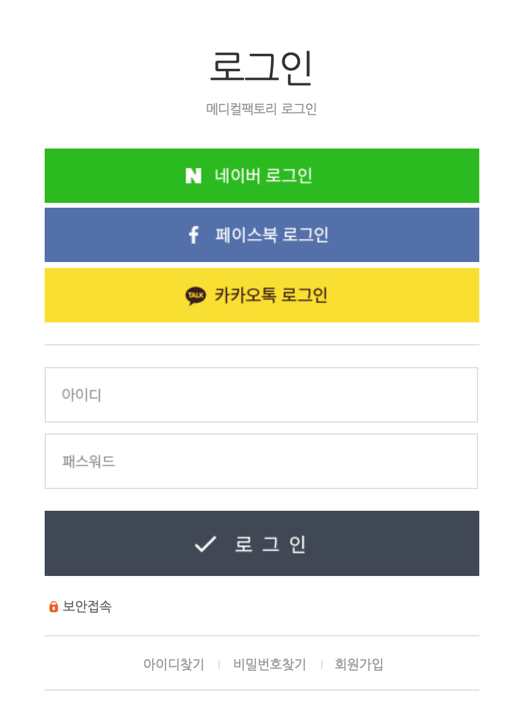
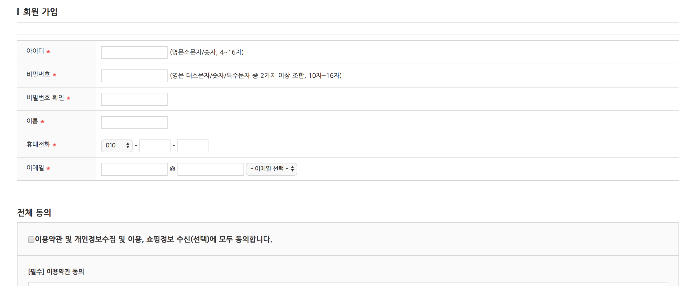
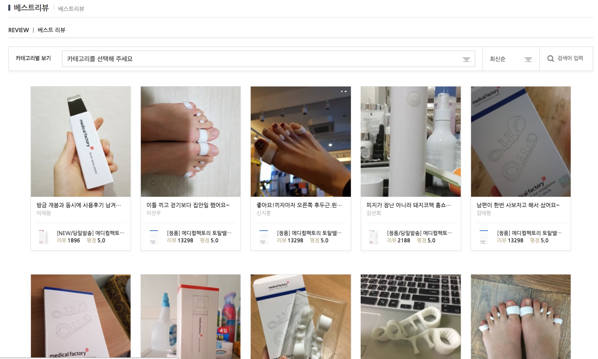

# 메디컬 팩토리 명세 현황

## 로그인

- social 로그인 기능 => 자체 페이지 외의 외부 대형 소셜매체의 본인정보를 api 를 통해 가져와 회원가입을 거치지 않고 로그인 활동 가능 기능.

  - Naver
  - Facebook
  - kakao talk

- 로그인이 되지않는 여러가지 오류 logic 이 있다. (정확히는 알수 없으나 내가 시도해본것만 적어보면)

  - 아이디 한글입력
  - 아이디에 @ 넣기
  - input 칸이 비었을 때
  - input 값이 length 가 짧을 떄

- 보안접속은 아이콘만 있음...

  - 뭐지..??
  - 뭘까..
  - https 상에서 접속함을 나타냄??
  - 여쭤보자

- 아이디 찾기, 비밀번호 찾기, 회원가입 폼
  - 아래 구현을 통해 로그인에 장애가 생겼을 시 문제 해결해주는 tab
  - 아이디가 기억이 나지 않으면 아이디 찾기
  - 비밀번호가 기억이 나지 않으면 비밀번호 찾기
  - 가입을 하지 않았으면 회원가입하기
  - 아이디 찾기에는 이메일로 찾기와 번호로 찾기 기능이 있음.
  - 굉장히 많은 html 을 가지고 있음..

## 회원가입

- 아이디는 영어 소문자와 숫자 로 이루어져 있으며 4~16 자 사이에 length 를 가지고 있어야 한다.
- 비밀번호는 영문/숫자/특수문자 중 2 가지 조합 10~16 자
- 비밀번호와 비밀번호 확인이 같아야 되는 login
- 휴대전화의 자리마다 length 가 4 자리를 넘으면 안된다.
- 이메일은 한국인들이 자주쓰는 이메일 주소를 쉽게 선택할 수 있는 기능
- 법에 따른 약관 동의서 존재

## 리뷰

- 간단한 CRUD 게시판 에다가 image 를 보여줄 수 있다.
- 이미지 click 시에 선택한 이미지가 정면으로 나오고 뒤에 배경은 화면이 black 이되는 애니메이션 처리
- 댓글기능 n:n
  - 로그인이 된 상태에서만 작성가능
- 아무 글이나 쓰지 않고 도움이 되는 글이 될수 있는 추천기능
  - 추천기능은 한명당 1 번밖에 못한다.
  - 로그인을 한 상태에서 진행해야됨
- 카테고리 선택을 통해 Filter 기능
- 검색을 통하여 자신이 원하는 키워드를 선택
  - query 문을 통해 찾겠다.(루비에서 구현해봄)
